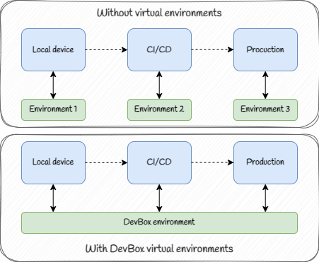

 

### Welcome to our executable tutorial!

We are going to talk about DevBox, a tool that creates isolated environments for any kind of project, so you can install packages and accelerate the processes of your project.

Just as a remainder, the environments are isolated spaces where you can choose which packages to have. 

Here you will learn:
- Why DevBox is useful.
- How to install dependencies using DevBox.
- How to create scripts in DevBox
- How to replicate the same environment is your CI/CD pipeline with GH Actions

#### Relevance

You might be wondering why we should use this virtual environment creator instead of others out there. The special thing about this one is that in addition to assuring reproducibility, it can also help you manage your project more efficiently with custom commands that trigger scripts you defined, or automatic triggers when you initiate the environment. Then, it's also easier to integrate this scripts into your Github Actions pipeline, with clear, readable and short code. We will talk more about this in a bit. 

Another thing to keep in mind is that when you install packages directly to the system, you have to repeat the process if you change machines or want to deploy it. Instead, when using DevBox you also assure the consistency across local, testing and production setups, as you can see in the following figure, since you use the same environment, and you know at any time the packages your project has avaliable.

**HAVE FUN**
